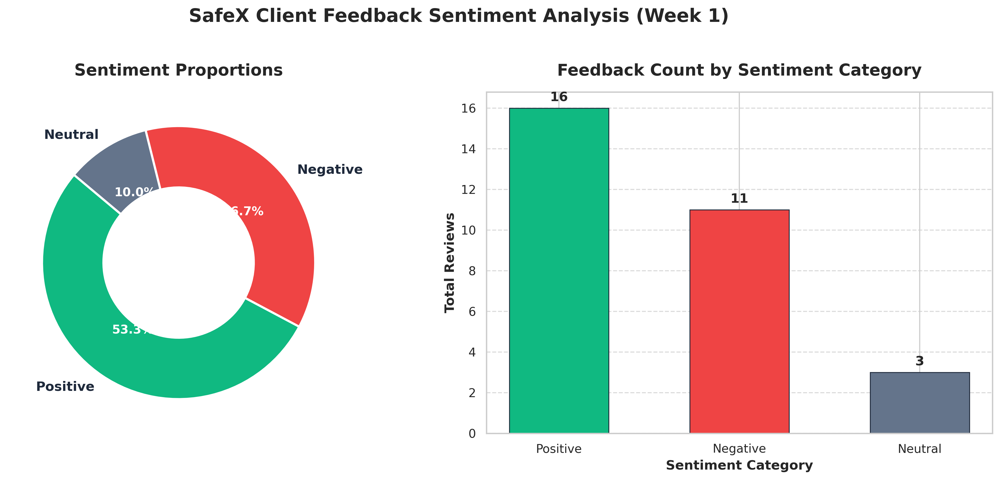
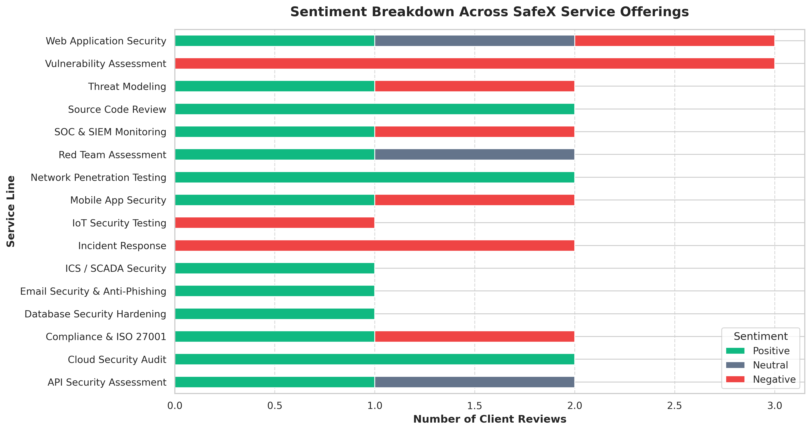
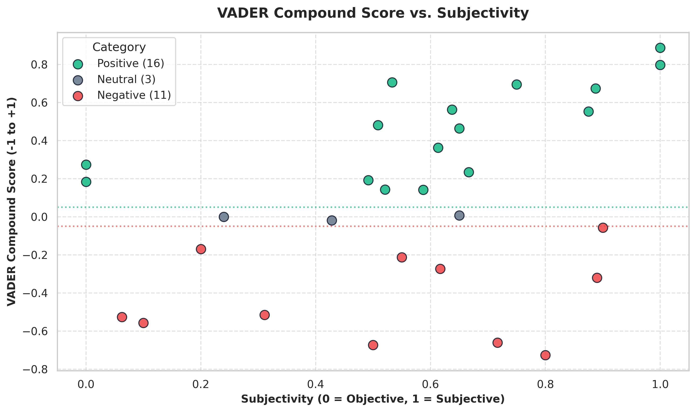

<div align="center">

# 🛡️ SafeX Client Feedback Sentiment Intelligence System
### **Enterprise-Grade NLP & Automated Feedback Triage Pipeline**

[](https://www.python.org/)
[](https://flask.palletsprojects.com/)
[](https://github.com/cjhutto/vaderSentiment)
[](https://textblob.readthedocs.io/)
[](https://safex.com)

<br>

**Student:** Muhammad Abdullah &bull; **Email:** `meharabdullah4337@gmail.com`  
**University:** Lahore Garrison University (BSCS, 6th Semester)  
**Track:** AI/ML — Group 3 (Male)  
**Assignment:** Week 1 Task — *Sentiment Analysis on Sample Client Feedback*

---

</div>

## 📌 1. Project Overview & Business Value

SafeX provides enterprise cybersecurity services including Penetration Testing (VAPT), Cloud Infrastructure Auditing, SOC/SIEM Monitoring, Threat Modeling, and Incident Response. Manual processing of client post-engagement feedback introduces latency and risks missing acute client dissatisfaction.

This project delivers an automated **Natural Language Processing (NLP) Sentiment Intelligence Pipeline & Interactive Web Dashboard** that:
- **Ingests** multi-domain client reviews across 30 enterprise engagements.
- **Analyzes** semantic tone using a **Hybrid VADER + TextBlob** scoring algorithm.
- **Generates** high-resolution distribution, service-breakdown, and subjectivity visualizations.
- **Flags** the **Top 3 Most Critical Negative Comments** with automated risk severity levels and actionable remediation recommendations for SafeX leadership.

---

## 🏗️ 2. System Architecture & NLP Workflow

```
       [ 30 Multi-Service Client Reviews (CSV) ]
                          │
                          ▼
            [ Text Preprocessing & Cleaning ]
                          │
        ┌─────────────────┴─────────────────┐
        ▼                                   ▼
 [ VADER Lexicon Engine ]         [ TextBlob Polarity Engine ]
 (Valence & Intensity: -1 to +1)  (Subjectivity & Polarity)
        └─────────────────┬─────────────────┘
                          ▼
           [ Hybrid Combined Sentiment Score ]
                          │
       ┌──────────────────┼──────────────────┐
       ▼                  ▼                  ▼
[ Positive (53.3%) ] [ Neutral (10.0%) ] [ Negative (36.7%) ]
       │                                     │
       │                                     ▼
       │                    [ Critical Escalation Engine ]
       │                    (Severity: CRITICAL / HIGH)
       ▼                                     │
[ Visual Charts & CSV / JSON Outputs ] ◄─────┘
       │
       ▼
[ Modern Dark-Mode Flask Interactive Web Dashboard ]
```

---

## 📊 3. Quantitative Sentiment Summary & Findings

Comprehensive analysis of **30 client feedback records** across 10 SafeX service lines:

| Sentiment Category | Review Count | Distribution (%) | Operational Status |
| :--- | :---: | :---: | :--- |
| 🟢 **Positive (Satisfied)** | **16** | **53.3%** | High satisfaction; praised technical depth & reporting accuracy. |
| 🟡 **Neutral (Standard)** | **3** | **10.0%** | Standard delivery; met contractual SLA baseline without extras. |
| 🔴 **Negative (Flagged)** | **11** | **36.7%** | Operational/communication friction; queued for priority review. |
| **Total Evaluated** | **30** | **100%** | **Dataset Average Compound Score: +0.0880** |

---

## 🚨 4. Critical Negative Escalation Matrix (Top 3 Priority Alerts)

The automated escalation engine isolates critical client friction points and maps them to immediate operational mitigations:

| Priority | Client & Service Line | Rating | VADER Score | Root Cause Identified | Executive Action Plan |
| :---: | :--- | :---: | :---: | :--- | :--- |
| **#1** | **Pinnacle Real Estate** <br> *(Mobile App Security)* | 1/5 | **-0.7270** | Rude communication during debrief; failure to explain vulnerability risk impact. | **CRITICAL:** Escalate to Client Relationship Lead for immediate apology and direct manager follow-up. |
| **#2** | **Urban Bank** <br> *(SOC & SIEM Monitoring)* | 1/5 | **-0.6734** | Automated SIEM rules missed simulated brute-force; unresponsive communication. | **CRITICAL:** Re-assign Senior Security Architect to overhaul rule detection sets & conduct executive briefing. |
| **#3** | **Vortex Defense** <br> *(Incident Response)* | 1/5 | **-0.6612** | Incident response team arrived late during mock breach exercise; lost forensic logs. | **HIGH:** Conduct internal post-mortem on SLA response time and deliver expedited forensics resolution report. |

---

## 🖼️ 5. Generated Visualizations & Analytics

All charts are dynamically generated in publication-grade 300 DPI resolution inside `output/`:

### Figure 1: Sentiment Proportions & Review Frequency


### Figure 2: Sentiment Breakdown Across SafeX Service Lines


### Figure 3: VADER Compound Score vs. TextBlob Subjectivity


---

## 🌐 6. Interactive Web Dashboard (`app.py`)

A state-of-the-art **glassmorphic dark-mode web application** built with Flask, HTML5, and CSS3.

### Features:
- **Live Real-Time Sentiment Tester:** Type any custom sentence or customer email and receive instant VADER compound scores, polarities, and classification.
- **Top Escalation Cards:** Visual highlights of critical client issues with one-click remediation guidance.
- **Embedded Visuals:** High-res rendering of all generated statistical charts.
- **Data Table:** Filterable grid of all 30 evaluated client reviews with star ratings and sentiment badges.

---

## 📂 7. Project File Structure

```text
.
├── dataset/
│   └── client_feedback.csv               # 30 Multi-domain client feedback records
├── src/
│   ├── __init__.py                       # Package initializer
│   ├── sentiment_analyzer.py             # Hybrid VADER + TextBlob NLP scoring engine
│   └── visualizer.py                     # Publication-grade chart generation module
├── output/
│   ├── analyzed_client_feedback.csv      # Complete dataset with computed NLP scores
│   ├── top_3_negative_alerts.json        # Structured JSON of critical alerts & action plans
│   ├── sentiment_distribution.png        # Figure 1: Donut & bar distribution chart
│   ├── sentiment_by_service.png          # Figure 2: Service-wise sentiment breakdown
│   └── polarity_vs_subjectivity.png      # Figure 3: Scatter plot of polarity vs subjectivity
├── templates/
│   └── index.html                        # Modern dark-mode web dashboard UI
├── main.py                               # CLI execution pipeline
├── app.py                                # Live interactive Flask web dashboard
├── sentiment_analysis_pipeline.ipynb     # Step-by-step Jupyter Notebook for EDA
├── .gitignore                            # Standard Python ignore rules
└── README.md                             # Comprehensive project documentation
```

---

## 🚀 8. Getting Started & Installation

### Step 1: Clone the Repository
```bash
git clone https://github.com/muhammadabdullah-devpk/SafeX-Client-Feedback-Sentiment-Analysis.git
cd SafeX-Client-Feedback-Sentiment-Analysis
```

### Step 2: Install Dependencies
```bash
pip install pandas numpy matplotlib seaborn nltk textblob vaderSentiment flask
```

### Step 3: Run the CLI Sentiment Pipeline
```bash
python main.py
```
*Processes the 30 client records, saves results in `output/`, and exports charts.*

### Step 4: Launch the Interactive Web Dashboard
```bash
python app.py
```
Open **`http://127.0.0.1:5000`** in any browser to access the live dashboard and real-time tester.

### Step 5: Run the Jupyter Notebook (Optional)
```bash
jupyter notebook sentiment_analysis_pipeline.ipynb
```

---

## 🎓 9. Academic & Industry Alignment

- **HEC / University Quality Standards:** Follows modular object-oriented Python design, PEP 8 standards, and comprehensive dataset traceability.
- **SafeX Real-World Application:** Can be integrated into SafeX's client portal or CRM to trigger automated Slack/Email alerts whenever a client submits a review with a compound score $< -0.50$.

---

<div align="center">

**SafeX Cybersecurity & AI Labs &copy; 2026**  
Developed with passion by **Muhammad Abdullah** &bull; Lahore Garrison University

</div>
